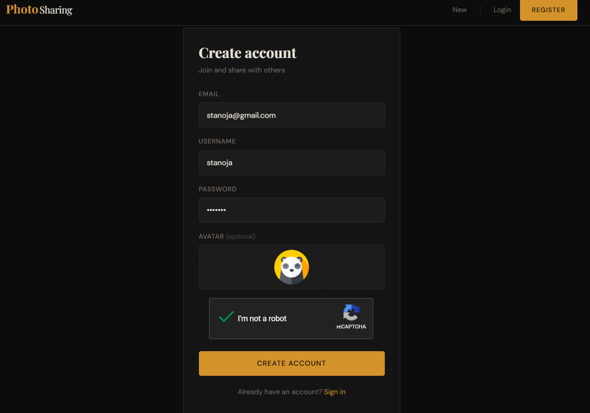
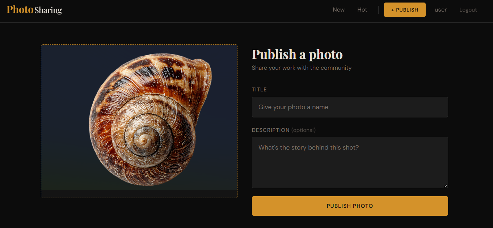
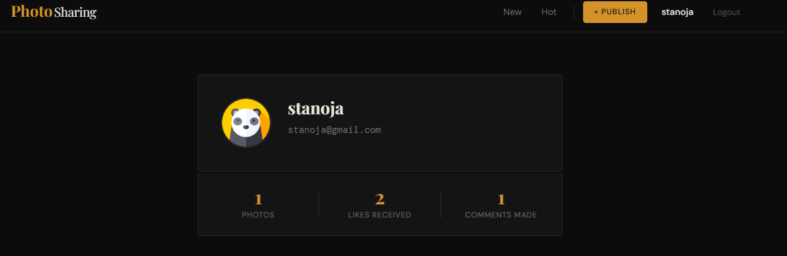

# Photo-Sharing Web Application


A full-stack photo sharing web app where users can upload, like, dislike, report, and comment on photos. Features a "Hot" feed powered by a time-decay algorithm that surfaces trending content.

---

## Screenshots

**Register**


**Publish Photo**


**View Photo**


**Profile View**


---

## Tech Stack

**Backend**

- Node.js + Express
- MongoDB + Mongoose
- express-session + connect-mongo (persistent sessions)
- bcrypt (password hashing)
- multer (file uploads)
- CORS

**Frontend**

- React 18
- React Router v6
- Context API (global auth state)
- CSS
- FontAwesome (icons)
- react-google-recaptcha (registration protection)

---

## Features

- Upload photos with a name, description, and image file
- Like and dislike photos
- Hot feed — photos ranked by a time-decay scoring algorithm
- Comment on photos (logged-in users only)
- Report photos — auto-hidden after 3 reports
- User profiles with stats (photos posted, likes received, comments made)
- Session-based authentication with persistent login
- reCAPTCHA on registration
- Avatar upload on registration

---

## Getting Started

### Prerequisites

- Node.js
- MongoDB running locally on port 27017

### Backend

```bash
cd backend
npm install
npm run dev
```

Runs on `http://localhost:3001`

### Frontend

```bash
cd frontend
npm install
npm start
```

Runs on `http://localhost:3000`

---

## Environment

The backend connects to a local MongoDB instance by default:

```
mongodb://127.0.0.1/PhotoApp
```
